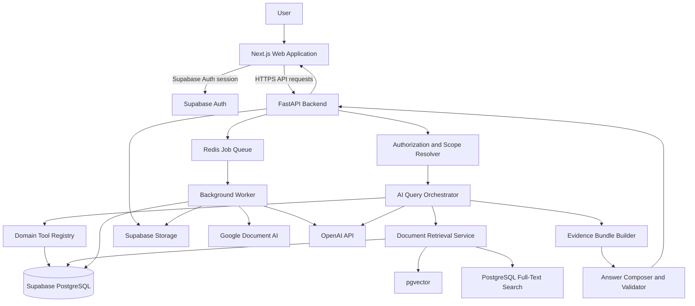
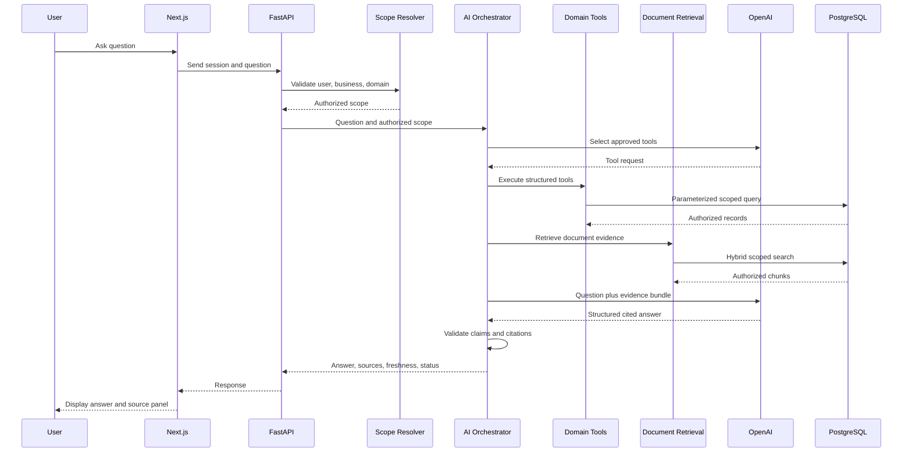

# Company Brain — System Architecture

**Status:** Approved development baseline  
**Architecture version:** 2.0  
**Date:** 2026-07-11  
**Repository:** `soilsystems/companybrain`

---

## 1. Purpose

Company Brain is a multi-tenant, multi-business, multi-domain business intelligence and knowledge platform.

Users select a business workspace and domain, then ask questions through a chatbot-style interface. Answers must be generated only from authorized business data stored in Company Brain.

Initial use cases include:

1. Dubai Fruits & Vegetables market intelligence.
2. Business deals, commitments, risks, payment terms, and timelines.
3. Uploaded documents and files used as internal business knowledge.
4. Future domains such as sales, inventory, finance, operations, policies, and customer intelligence.

Company Brain is not a general-purpose chatbot. It is an evidence-grounded business assistant.

---

## 2. Core Product Principle

> The LLM interprets the question and composes the answer.  
> The database and authorized documents provide the truth.

The model must never generate business facts from memory.

Every important factual claim must be traceable to:

- a structured database record,
- an authorized document chunk,
- or a controlled combination of both.

When sufficient evidence is unavailable, the system must explicitly return:

- `not_found`,
- `partial`,
- `clarification_required`,
- `forbidden`,
- or `error`.

It must not guess.

---

## 3. Technology Stack

### 3.1 Frontend

- Next.js
- TypeScript
- Tailwind CSS
- shadcn/ui
- TanStack Query
- React Hook Form
- Zod

### 3.2 Trusted Backend

- FastAPI
- Python
- Pydantic
- SQLAlchemy 2.x
- Alembic

### 3.3 Data Platform

- Supabase PostgreSQL
- Supabase Auth
- Supabase Storage
- pgvector
- PostgreSQL full-text search

### 3.4 Background Processing

Initial implementation:

- Dramatiq
- Redis

The queue abstraction must remain replaceable so that a managed system such as Google Cloud Tasks can be adopted later without rewriting domain services.

### 3.5 AI and Extraction

- OpenAI Responses API
- Configurable OpenAI chat/reasoning models
- OpenAI embeddings
- Google Document AI for scanned PDFs, images, and table-heavy reports
- Deterministic parsers for DOCX, XLSX, CSV, TXT, and text-based PDFs

### 3.6 Deployment

- Frontend: Vercel
- FastAPI API: Google Cloud Run
- Background worker: Google Cloud Run
- Database, Auth, Storage: Supabase
- Redis: managed Redis provider
- CI/CD: GitHub Actions
- Monitoring: Sentry and structured cloud logs

---

## 4. High-Level Architecture



---

## 5. Logical Business Hierarchy

```text
Organization
└── Business Workspace
    ├── Market Intelligence Domain
    ├── Business Deals Domain
    ├── Business Knowledge Domain
    ├── Sales Domain
    ├── Finance Domain
    └── Future Domains
```

### 5.1 Organization

The customer or company account using Company Brain.

Example:

```text
Soil Systems
```

### 5.2 Business Workspace

A business, subsidiary, department, or operating unit.

Examples:

```text
Dubai Fruits Trading
Real Estate Division
Logistics Business
```

### 5.3 Domain

A controlled knowledge area inside a business workspace.

Examples:

```text
Market Intelligence
Deals
Documents
Sales
Finance
Inventory
Operations
```

Every business-owned row must include:

- `organization_id`
- `business_id`

Domain-owned records must also include or derive:

- `domain_id`

---

## 6. Domain Registry

The Domain Registry controls how each business domain behaves.

Each domain registration contains:

- domain slug,
- display name,
- description,
- enabled status,
- allowed tools,
- allowed structured data sources,
- allowed document collections,
- required permission,
- system instructions,
- terminology,
- citation rules,
- freshness rules,
- supported question types,
- fallback behavior,
- model configuration,
- retrieval configuration.

Example:

```json
{
  "slug": "dubai-market",
  "name": "Dubai Vegetable Market",
  "required_permission": "market.read",
  "allowed_tools": [
    "get_latest_market_price",
    "compare_market_prices",
    "get_price_history",
    "get_market_summary"
  ],
  "document_search_enabled": true
}
```

The selected domain determines which tools the model can see.

The model must not receive every system tool at once.

---

## 7. Core Platform Modules

The following modules are shared by every business domain:

- authentication,
- organizations,
- business workspaces,
- memberships,
- roles and permissions,
- domain registry,
- data-source registry,
- document storage,
- ingestion jobs,
- conversations and messages,
- AI orchestration,
- tool registry,
- evidence bundles,
- citations,
- notifications,
- audit logs,
- usage and cost tracking,
- administrative settings.

---

## 8. Initial Domain Modules

### 8.1 Dubai Market Intelligence

Responsibilities:

- report upload,
- scanned PDF processing,
- OCR,
- table extraction,
- product normalization,
- human-reviewed staging,
- append-only market price history,
- precomputed summaries,
- market analytics,
- market-specific AI tools.

Example questions:

- What is the cheapest onion today?
- Compare Indian and Pakistani potato prices.
- Show the biggest price increases this week.
- What products were unavailable today?

### 8.2 Business Deals

Responsibilities:

- deal records,
- counterparties,
- deal values and currencies,
- stages,
- owners,
- deadlines,
- payment terms,
- commitments,
- approvals,
- risks,
- deal timelines,
- attached documents,
- deal-specific AI tools.

Example questions:

- What payment terms were agreed with ABC Trading?
- Which deals are awaiting approval?
- What commitments are due this week?
- Summarize the risks in the XYZ deal.

### 8.3 Business Knowledge

Responsibilities:

- document uploads,
- versions,
- metadata,
- extraction,
- chunking,
- embeddings,
- permissions,
- hybrid retrieval,
- document citations.

Example questions:

- What does our leave policy say?
- Summarize the latest proposal for Project Alpha.
- What was agreed in the last operations meeting?
- Find all documents mentioning delayed shipment.

---

## 9. Authentication and Authorization

### 9.1 Authentication

Supabase Auth identifies the user.

FastAPI validates the Supabase access token and maps the authenticated user to the internal Company Brain user record.

Authentication answers:

> Who is this user?

### 9.2 Authorization

Company Brain determines:

- which organization the user belongs to,
- which businesses the user can access,
- which domains the user can query,
- what role the user has,
- what actions the user can perform.

Authorization answers:

> What is this user allowed to access and do?

### 9.3 Security Rule

The frontend may send a requested `business_id` and `domain_id`, but FastAPI must independently verify membership and permission.

Client-supplied IDs never establish access by themselves.

---

## 10. Database Architecture

Use one Supabase PostgreSQL database.

Do not create a separate physical database for every business or domain during the initial phases.

Use logical PostgreSQL schemas:

```text
core
chat
knowledge
market
deals
audit
```

### 10.1 Core Schema

Suggested entities:

- `organizations`
- `businesses`
- `users`
- `memberships`
- `roles`
- `permissions`
- `domains`
- `business_domains`
- `data_sources`

### 10.2 Chat Schema

Suggested entities:

- `chat_sessions`
- `chat_messages`
- `tool_calls`
- `evidence_bundles`
- `answer_sources`
- `answer_feedback`
- `model_usage`

### 10.3 Knowledge Schema

Suggested entities:

- `documents`
- `document_versions`
- `document_files`
- `document_permissions`
- `document_tags`
- `ingestion_jobs`
- `ingestion_attempts`
- `extracted_sections`
- `document_chunks`
- `chunk_embeddings`

### 10.4 Market Schema

Suggested entities:

- `uploads`
- `upload_rows`
- `ocr_logs`
- `products`
- `product_variants`
- `product_aliases`
- `countries`
- `shipment_types`
- `packing_types`
- `daily_prices`
- `price_history_daily`
- `product_latest_price`
- `market_summaries`

### 10.5 Deals Schema

Suggested entities:

- `deals`
- `deal_parties`
- `deal_members`
- `deal_events`
- `deal_commitments`
- `deal_risks`
- `deal_approvals`
- `deal_documents`

### 10.6 Audit Schema

Suggested entities:

- `audit_events`
- `security_events`
- `job_events`

---

## 11. Chat Session Scope

Every chat session is pinned to:

- `organization_id`
- `business_id`
- `domain_id`
- `created_by_user_id`

A domain change should normally start a new session.

A cross-domain question is allowed only when:

1. an explicit cross-domain tool exists,
2. the user has access to all participating domains,
3. every retrieved source remains properly scoped,
4. the action is audited.

---

## 12. AI Query Flow



---

## 13. Retrieval Modes

### 13.1 Structured Tool Calling

Use for exact information such as:

- prices,
- quantities,
- deal values,
- currencies,
- dates,
- statuses,
- commitments,
- analytics,
- product and customer records.

Examples:

```text
get_latest_market_price
compare_market_prices
get_price_history
get_market_summary
search_deals
get_deal_details
get_pending_commitments
```

The LLM chooses a tool.

FastAPI:

1. validates the tool arguments,
2. applies organization/business/domain filters,
3. executes parameterized queries,
4. returns normalized evidence.

The LLM must never execute arbitrary SQL.

### 13.2 Document Retrieval

Use for:

- contracts,
- proposals,
- meeting notes,
- reports,
- policies,
- manuals,
- PDFs,
- spreadsheets,
- uploaded business files.

Retrieval combines:

- PostgreSQL full-text search,
- pgvector semantic search,
- reciprocal-rank fusion,
- optional future reranking.

### 13.3 Hybrid Retrieval

Use when one question requires both structured and unstructured evidence.

Example:

> What is the value of the ABC deal, and what delivery risks are mentioned in the proposal?

The answer may combine:

- exact deal value from `deals`,
- risks from document chunks.

---

## 14. Evidence Bundle

Tools must return normalized evidence rather than conversational prose.

Example:

```json
{
  "scope": {
    "organization_id": "org_123",
    "business_id": "biz_456",
    "domain_id": "deals"
  },
  "question": "What payment terms were agreed with ABC Trading?",
  "evidence": [
    {
      "source_type": "structured_record",
      "source_id": "deal_123",
      "field": "payment_terms",
      "value": "30% advance and 70% before shipment",
      "observed_at": "2026-07-11T00:00:00Z"
    },
    {
      "source_type": "document_chunk",
      "document_id": "doc_456",
      "document_version_id": "version_3",
      "chunk_id": "chunk_19",
      "page_start": 3,
      "page_end": 3,
      "text": "Relevant extracted text",
      "retrieval_score": 0.82
    }
  ]
}
```

---

## 15. Answer Contract

The answer model should return structured output containing:

- `status`
- `answer`
- `citations`
- `freshness`
- `confidence`
- optional `table`
- optional `chart`
- `unsupported_claim_detected`

Supported statuses:

```text
answered
partial
clarification_required
not_found
forbidden
error
```

Citations must be generated from stored source metadata, not invented by the model.

---

## 16. Document Storage Architecture

Original files must be stored in private Supabase Storage.

Large binary files must not be stored directly in PostgreSQL.

```text
Supabase Storage
├── original files
├── extraction artifacts
└── derived preview files

Supabase PostgreSQL
├── metadata
├── versions
├── permissions
├── ingestion state
├── extracted sections
├── chunks
├── embeddings
└── citation provenance
```

Suggested storage path:

```text
organizations/{organization_id}/
businesses/{business_id}/
domains/{domain_id}/
documents/{document_id}/
versions/{version_id}/
original/{safe_filename}
```

Storage objects must be private.

Downloads use short-lived signed URLs.

---

## 17. Document Upload Flow

1. User requests an upload intent.
2. FastAPI checks upload permission.
3. FastAPI creates a pending document and version.
4. FastAPI issues a short-lived signed upload URL.
5. Browser uploads directly to Supabase Storage.
6. Browser confirms completion.
7. FastAPI verifies object path, size, MIME type, and checksum.
8. FastAPI creates an idempotent ingestion job.
9. Worker extracts document content and structure.
10. Worker chunks the extracted content.
11. Worker generates embeddings.
12. Worker builds full-text and vector indexes.
13. Document version becomes searchable.
14. Processing status and errors are visible to the user.

---

## 18. Supported Initial File Types

Initial target:

- PDF
- DOCX
- XLSX
- CSV
- TXT
- PNG
- JPEG

Future additions may include:

- email formats,
- presentations,
- archives,
- additional image types.

---

## 19. Extraction Strategy

Use deterministic or native extraction first.

### Text-based PDF

Use a native PDF parser while preserving:

- page numbers,
- headings,
- paragraphs,
- tables,
- reading order.

### Scanned PDF or Image

Use Google Document AI.

Preserve:

- page structure,
- tables,
- cells,
- OCR confidence,
- source coordinates when useful.

### DOCX

Preserve:

- headings,
- paragraphs,
- tables,
- lists,
- section order.

### XLSX and CSV

Preserve:

- workbook and sheet names,
- table boundaries,
- column headers,
- row groups,
- cell types.

### TXT

Use direct extraction with encoding detection and normalization.

---

## 20. Chunking Strategy

Use structure-aware hierarchical chunking.

Do not use blind fixed-size character slicing as the primary method.

### 20.1 Recommended Default

```text
Target chunk size: 750 tokens
Maximum chunk size: 1,000 tokens
Overlap: 100 tokens
Retrieval candidates: 30–50
Final evidence chunks: 5–10
```

These values are configuration and must be evaluated per domain.

### 20.2 General Documents

Chunk by:

```text
Document
→ Page
→ Heading
→ Section
→ Paragraph
→ Sentence
```

### 20.3 Contracts and Deals

Preserve:

- clause numbers,
- definitions,
- parties,
- obligations,
- payment terms,
- dates,
- termination clauses,
- annexure references.

Do not split a legal clause unnecessarily.

### 20.4 Spreadsheets

Chunk by:

```text
Workbook
→ Sheet
→ Table
→ Column headers
→ Related row groups
```

Each spreadsheet chunk should carry:

- sheet name,
- table name,
- headers,
- row range.

Never embed isolated cells without context.

### 20.5 Tables

Never split a table row across chunks.

Repeat the table header or section context in the chunk metadata or content representation.

---

## 21. Embeddings

Recommended default:

```text
Model: text-embedding-3-large
Dimensions: 1024
Distance metric: cosine
```

Lower-cost alternative:

```text
Model: text-embedding-3-small
```

Store the following with each embedding:

- embedding model,
- embedding dimensions,
- embedding version,
- embedded timestamp,
- chunker version,
- content hash.

Changing model or dimensions requires controlled re-indexing.

---

## 22. Hybrid Search

For every searchable chunk, store:

- normalized text,
- PostgreSQL `tsvector`,
- vector embedding,
- authorization metadata.

Recommended indexes:

- GIN for full-text search,
- HNSW for vector search.

Retrieval flow:

1. validate user scope,
2. filter organization, business, domain, and permissions,
3. run keyword and semantic search,
4. combine rankings using reciprocal-rank fusion,
5. remove stale or inaccessible versions,
6. optionally rerank,
7. select diverse evidence,
8. generate answer.

---

## 23. Reranking Strategy

Do not add a separate reranking transformer during the first scaffold.

Start with:

- full-text search,
- vector search,
- reciprocal-rank fusion.

Build a real evaluation set first.

Add a hosted or self-hosted cross-encoder reranker only when evaluation shows that relevant chunks are retrieved but poorly ordered.

Reranking must happen after authorization filtering.

---

## 24. Anti-Hallucination Controls

The architecture must enforce the following controls:

1. No arbitrary SQL generation.
2. No model access to database credentials.
3. No business answer from model memory.
4. Only approved domain tools are visible.
5. All tool arguments are schema-validated.
6. All queries are organization and business scoped.
7. Document retrieval is permission filtered before ranking.
8. Document text is treated as untrusted data.
9. Instructions found inside documents cannot override system rules.
10. Numeric, financial, contractual, and date claims require evidence.
11. Citations come from stored metadata.
12. Missing evidence returns `not_found` or `partial`.
13. Cross-domain retrieval requires explicit permission and tooling.
14. Tool calls, evidence, and outputs are audited.
15. Sensitive answers may undergo post-generation claim validation.

---

## 25. Market Report Trust Model

The Dubai market report pipeline has a stronger trust requirement.

```text
Upload
→ OCR
→ Row reconstruction
→ Normalization
→ Validation
→ Human-reviewed staging
→ Publish structured facts
→ Recompute analytics
```

OCR and LLM output must never become official market price history without human review.

Published market facts are append-only.

Corrections must be recorded as revisions with audit history.

---

## 26. Background Jobs

Long-running work must not run inside normal HTTP requests.

Background jobs include:

- document extraction,
- OCR,
- table reconstruction,
- normalization,
- chunking,
- embedding generation,
- re-indexing,
- market summary recomputation,
- notifications,
- cleanup and retention tasks.

Every job must be:

- idempotent,
- retryable,
- observable,
- scoped,
- auditable.

Record:

- job type,
- status,
- attempt number,
- input identity,
- worker version,
- parser version,
- start and finish times,
- safe error details.

---

## 27. API Boundaries

Suggested API groups:

```text
/api/auth
/api/organizations
/api/businesses
/api/domains
/api/documents
/api/ingestion
/api/chat
/api/market
/api/deals
/api/admin
/api/audit
```

The frontend must communicate with FastAPI for protected business operations.

The Supabase service-role key must never be exposed to the browser.

---

## 28. Frontend Experience

Primary screens:

- Login
- Organization selector
- Business selector
- Domain selector
- Chat
- Conversation history
- Source panel
- Document upload
- Document library
- Processing status
- Market upload and review
- Market dashboards
- Deals management
- Admin and permissions
- Audit and usage

The chat header should clearly show:

```text
Business: Dubai Fruits Trading
Domain: Market Intelligence
Data updated: July 11, 2026
```

---

## 29. Repository Structure

```text
companybrain/
├── apps/
│   ├── web/
│   ├── api/
│   └── worker/
├── packages/
│   ├── ui/
│   ├── api-client/
│   └── shared-types/
├── database/
│   ├── migrations/
│   ├── seeds/
│   └── policies/
├── ai/
│   ├── domains/
│   ├── prompts/
│   ├── tools/
│   ├── schemas/
│   └── evals/
├── testing/
│   ├── fixtures/
│   ├── integration/
│   ├── security/
│   └── ai-evals/
├── infrastructure/
│   ├── docker/
│   ├── github/
│   └── deployment/
├── docs/
│   ├── architecture/
│   ├── decisions/
│   ├── product/
│   ├── legacy/
│   └── runbooks/
├── scripts/
├── AGENTS.md
├── ARCHITECTURE.md
├── PROJECT_HANDOFF_V2.md
├── docker-compose.yml
├── Makefile
└── README.md
```

---

## 30. Development Phases

### Phase 0 — Transition and Architecture

- inventory local no-code files,
- preserve valuable business requirements,
- identify obsolete platform assumptions,
- adopt full-code ADRs,
- establish repository structure,
- establish development standards.

### Phase 1 — Core Platform

- Next.js scaffold,
- FastAPI scaffold,
- worker scaffold,
- Supabase development setup,
- authentication,
- organizations,
- businesses,
- memberships,
- domain registry,
- authorization tests,
- CI.

### Phase 2 — Chat and Evidence Foundation

- sessions,
- messages,
- domain-scoped tool registry,
- evidence bundle,
- citations,
- model gateway,
- structured answer contract,
- usage logging,
- mocked tools,
- AI evaluation harness.

### Phase 3 — Document Knowledge

- private uploads,
- document versions,
- ingestion jobs,
- extraction,
- chunking,
- embeddings,
- hybrid retrieval,
- source panel,
- document permission tests,
- prompt-injection tests.

### Phase 4 — Dubai Market Intelligence

- OCR spike,
- report ingestion,
- staging,
- review,
- publication,
- analytics,
- market tools,
- market chat answers.

### Phase 5 — Business Deals

- deal schema,
- deal management,
- commitments,
- risks,
- approvals,
- linked documents,
- deal tools,
- hybrid deal answers.

### Phase 6 — Hardening and Production

- tenant-isolation testing,
- retrieval evaluation,
- hallucination evaluation,
- load testing,
- backup and restore,
- monitoring,
- production deployment,
- security review.

---

## 31. Testing Strategy

### Unit Tests

- services,
- repositories,
- validators,
- chunkers,
- tool argument validation,
- permission rules.

### Integration Tests

- API and PostgreSQL,
- Supabase token validation,
- document upload,
- job execution,
- structured tools,
- hybrid retrieval.

### Security Tests

- cross-organization access,
- cross-business access,
- cross-domain access,
- signed URL expiry,
- service-role key exposure,
- prompt injection,
- unauthorized document retrieval.

### AI Evaluations

For each domain, maintain golden questions with:

- expected tool,
- expected source IDs,
- expected facts,
- forbidden facts,
- expected answerability status.

Track:

- retrieval recall,
- citation precision,
- factual accuracy,
- unsupported claim rate,
- tool-selection accuracy,
- domain leakage,
- latency,
- token and embedding cost.

Release gates include:

- zero cross-tenant leakage,
- zero invented numerical or contractual claims in the golden evaluation set.

---

## 32. Architectural Invariants

The following rules must not be changed without a new ADR:

1. FastAPI is the trusted business backend.
2. Supabase service credentials remain server-side.
3. Every business record is organization and business scoped.
4. Every chat session is domain scoped.
5. LLMs never execute arbitrary SQL.
6. Structured facts are accessed through approved tools.
7. Documents are accessed through permission-filtered retrieval.
8. Uploaded document text is untrusted input.
9. Citations are based on stored provenance.
10. Missing evidence results in an explicit non-answer.
11. Market OCR data requires human review before publication.
12. Market facts are append-only.
13. Database changes require Alembic migrations.
14. Background jobs are idempotent and retryable.
15. Architecture and implementation changes are versioned in GitHub.
16. New domains extend the platform without bypassing core security and evidence systems.

---

## 33. Codex Development Rules

Codex must:

- read `AGENTS.md` and architecture documents before making changes,
- work in small, reviewable tasks,
- avoid deleting unreviewed legacy files,
- use migrations for schema changes,
- add tests with features,
- update documentation with behavior changes,
- never commit secrets,
- report commands and test results,
- mark unresolved decisions rather than guessing,
- stop when task acceptance criteria are met.

Codex must not redesign the architecture silently during implementation.

Any major deviation requires a new architecture decision record.

---

## 34. Immediate Next Step

The immediate Codex task is the transition assessment:

1. inspect the unpushed local files,
2. create a legacy inventory,
3. identify conflicts with the full-code architecture,
4. preserve useful business and OCR material,
5. propose the final repository structure,
6. prepare the Phase 1 scaffold plan,
7. stop before application implementation for review.

After that review, development begins with the core platform scaffold and authorization foundation.

---

*End of Company Brain Architecture v2.0*
