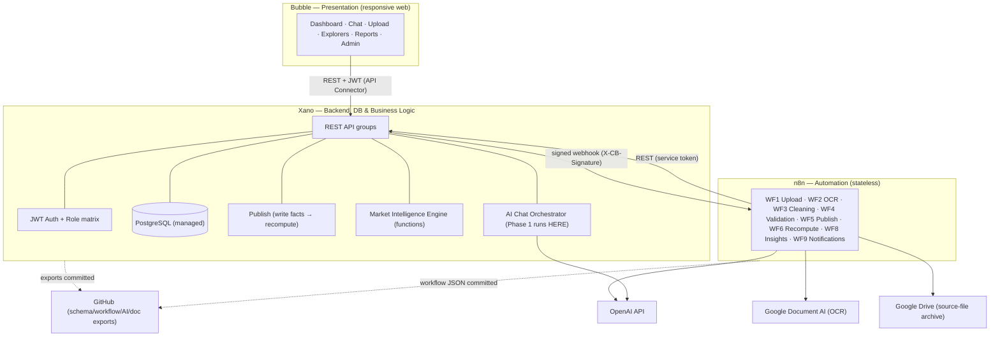
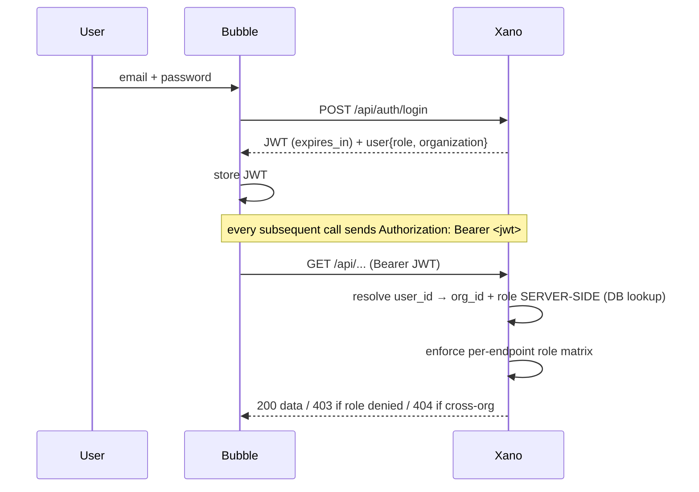
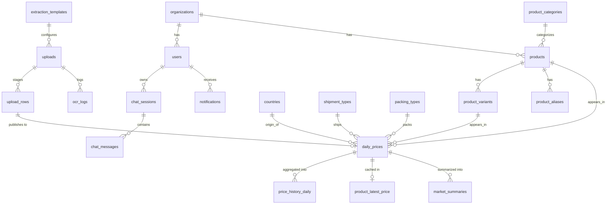

# PROJECT_HANDOFF.md — Company Brain

> **Read this first.** This document is the single onboarding source for another AI coding assistant (e.g. OpenAI Codex) continuing this project **without prior chat history**. It is written to be self-sufficient. Where a fact cannot be determined with certainty it is marked **Unknown** rather than guessed.
>
> **The most important thing to understand:** this is a **NO-CODE-FIRST** project. There is **no application source code** (no React/Node/Python/SQL) and there must not be, except thin CLI wrappers in `/scripts`. The product is built in **Bubble + Xano + n8n + Google Document AI + OpenAI + Google Drive**. This GitHub repo is the **system of record / documentation**, not the runtime. Do not "start coding features." See §18 (AI Context) before changing anything.

| | |
|---|---|
| **Handoff version** | 1.0 |
| **Date** | 2026-07-07 |
| **Current stage** | **Phase 0 — Foundation & De-risking** (docs approved, repo scaffolded, provisioning + OCR spike pending) |
| **Repo** | `companybrain` (branch `main`) |
| **Runtime built?** | **No.** No Xano/Bubble/n8n app exists yet. Repo = docs + scaffolding + provisioning scripts + seed data. |

---

## 1. Project Overview

- **Project name:** Company Brain.
- **Purpose:** An AI-powered business-intelligence platform that turns a company's recurring operational documents into permanent, structured, queryable data — with auto-generated dashboards and an AI assistant that answers **only** from the database.
- **Problem being solved:** The Dubai Fruits & Vegetables market report arrives daily as a **scanned PDF** with ~250–300 rows (product, origin, shipment, weight, packing, price in AED). It is glanced at once and lost. There is no history, no trend analysis, and staff answer the same price questions all day. Company Brain captures every report into append-only history and makes it answerable in plain language ("cheapest onion today", "compare India vs Pakistan potatoes", "onion price last 30 days").
- **Current development stage:** Phase 0. Full documentation set is written and approved; the repo is scaffolded; provisioning scripts, OCR-spike measurement framework, seed data, and ADRs exist. **Nothing has been built in the runtime platforms yet**, and the OCR accuracy spike (the Phase-0 gate) has **not** been run.
- **Target users (personas, see [docs/PRD.md](docs/PRD.md) §3):** P1 Market Admin (uploads/validates), P2 Buyer/Trader (queries prices), P3 General Manager (dashboard/AI), P4 Analyst (deep-dives/exports), P5 Platform Owner (future SaaS tenant onboarding).
- **Main features (Module 1 — Market Intelligence):**
  1. Daily report upload (PDF/scanned image/Excel) → OCR → normalization → **human-reviewed staging** → publish to append-only history.
  2. Canonical product system (Product/Variant/Country/Packing/Weight/Alias) with a learning alias loop.
  3. **Market Intelligence Engine**: precomputed daily summaries (averages, gainers/losers, missing products, country/shipment/availability distributions) feeding both dashboard and AI.
  4. Dashboards & explorers (Dashboard, Product Explorer, Country Explorer, Reports/Trends).
  5. AI chat assistant using **function/tool calling, not RAG** (RAG is reserved for a future Documents module).
  6. Notifications, audit, upload history.
- **Tech stack:**

  | Layer | Tool |
  |-------|------|
  | Frontend | Bubble (responsive web) |
  | Backend, DB, business logic, auth, AI chat orchestration | Xano (managed PostgreSQL + REST) |
  | Automation / orchestration | n8n |
  | OCR | Google Document AI (Custom Extractor) |
  | AI | OpenAI API |
  | File storage / archive | Google Drive |
  | Version control / docs | GitHub |
  | Provisioning CLIs (ops only) | `gcloud`, `gh`/`git`, `n8n` CLI, Xano Metadata API |

- **Folder structure overview:**

  ```
  docs/          Source-of-truth design docs (PRD, Architecture, Database, Workflow, Bubble, AI, API, Roadmap), ADRs, runbooks, Phase-0 report
  backend/       Xano system of record: schema exports (empty), api/functions inventories (empty), seeds/ (CSV reference data — POPULATED)
  automation/    n8n workflow JSON exports (empty until Phase 1)
  ai/            Prompts, chat tool schemas, eval sets (empty until Phase 3)
  frontend/      Bubble specs/assets (specs live in docs/Bubble.md)
  ocr/           Document AI config + the OCR SPIKE framework (POPULATED); samples/ + spike/results (empty until run)
  testing/       Test plan, golden fixtures (templates POPULATED), postman (empty)
  scripts/       Thin CLI wrappers for provisioning/export (POPULATED)
  ```
  Full rationale: [docs/FolderStructure.md](docs/FolderStructure.md).

---

## 2. Architecture

Authoritative source: [docs/Architecture.md](docs/Architecture.md). Summary below with diagrams.

### 2.1 Guiding principles (do not violate — see §18)
1. **Xano is the single source of truth.** Only Xano touches the database. Bubble and n8n reach data only via Xano's REST API.
2. **Core vs. Modules.** Shared core (auth, orgs, storage, notifications, AI assistant, Market Intelligence Engine, audit) is reused by every future module.
3. **AI proposes, the database disposes.** OCR/LLM extract and interpret; a human validates; only validated data becomes truth. The chatbot answers only from DB rows.
4. **Precompute for reads.** Dashboards/AI read precomputed tables, never scan the fact table.
5. **Configurable, append-only, idempotent.**

### 2.2 System component diagram



### 2.3 Frontend architecture (Bubble)
- All UI, display state, navigation, responsive layout, and chart rendering. Calls Xano via the **API Connector**. Holds **no** business logic, **no** data ownership, **no** third-party secrets. Pages and reusable components specified in [docs/Bubble.md](docs/Bubble.md). Screens: Login, Upload, Upload Detail (stepper + OCR log), Review & Publish grid, Upload History, Dashboard, Product Explorer, Country Explorer, Reports (Trends/Compare/Market Structure), Product Detail, Chat, Settings, Admin Panel.

### 2.4 Backend architecture (Xano)
- Owns database, REST API, JWT auth, **server-side role enforcement**, validation, the publish path (write facts → recompute), Market Intelligence Engine functions, **AI chat orchestration (Phase 1)**, notification fan-out, and audit. Does **not** run long OCR/ingestion (that's n8n).

### 2.5 Database architecture
- Managed PostgreSQL inside Xano. 20 tables (see §5 and [docs/Database.md](docs/Database.md)). Three data tiers: the append-only **fact** table (`daily_prices`) is the only price source of truth; **derived** tables (`price_history_daily`, `product_latest_price`, `market_summaries`) are disposable and rebuildable, and are what reads hit. `organization_id` on every business table (SaaS-ready).

### 2.6 Authentication flow


Details in §14 and [docs/Architecture.md](docs/Architecture.md) §3.

### 2.7 API flow
- Xano REST API groups: `/api/auth`, `/api/uploads`, `/api/ingest` (n8n-only), `/api/catalog`, `/api/prices`, `/api/analytics`, `/api/chat`, `/api/notifications`, `/api/admin`. Standard envelope `{data, meta}` / `{error:{code,message,details}}`. All lists paginated; no unbounded results. Full contracts: [docs/API.md](docs/API.md) and §6 here.

### 2.8 State management
- **Frontend:** Bubble page/element state + URL params; JWT held in Bubble. No Redux/etc (not a coded SPA).
- **Backend:** all durable state in Xano PostgreSQL.
- **Automation:** n8n is **stateless** — every workflow reads inputs from and writes results back to Xano; nothing persists between runs. Idempotency key = `upload_id + row_hash`.

### 2.9 Deployment architecture
- Each layer is a **hosted SaaS platform** (Bubble app, Xano workspace with dev+prod, n8n cloud or self-hosted, Google Cloud project, OpenAI account). There is no container/server to deploy. "Deployment" = promoting Xano dev→prod, publishing Bubble dev→live, and importing n8n workflow JSON. See §15. Specific hosting regions/plans: **Unknown** (chosen during Phase-0 provisioning).

### 2.10 Third-party integrations
| Integration | Used by | Purpose |
|-------------|---------|---------|
| Google Document AI | n8n WF2 | OCR of scanned report → structured cells + confidence |
| OpenAI API | n8n WF3 (normalization), Xano chat orchestrator, WF8 (narrative) | name normalization, tool selection, answer composition, daily narrative |
| Google Drive | n8n WF1/WF9 | immutable archive of every source file |
| GitHub | all | versioned exports of schema/workflows/AI/docs |

### 2.11 Background jobs, cron jobs, event flow, queues
- **Event-driven pipeline:** Bubble upload → Xano creates `uploads` row → **signed webhook** → n8n WF1→WF2→WF3→WF4 → staging → human review → `POST /publish` → WF5 → WF6 recompute.
- **Cron / scheduled (n8n):** **WF8 Daily Market Insights** (~07:30 local, org-configurable) ensures the day's summary + narrative exist, notifies users, and flags a *missing* report; **WF6 nightly** self-healing rebuild of aggregates; **WF9** housekeeping sweeps (retry pending Drive archives, purge chat > retention, purge read notifications > 6 mo).
- **Queues:** none as dedicated infra. n8n's execution model + Xano idempotent upserts serve the role. If throughput ever demands it, see escape hatches ([docs/Architecture.md](docs/Architecture.md) §10.3).

### 2.12 Report lifecycle (end-to-end event flow)

```mermaid
flowchart LR
    A[Daily PDF/scan] --> B[Bubble Upload]
    B --> C["Xano: create upload (status=uploaded)"]
    C -->|signed webhook| D[WF1 Upload: archive to Drive, queued]
    D --> E[WF2 OCR: Document AI + ocr_logs]
    E --> F["WF3 Cleaning: rules first, LLM leftovers; price_raw kept, NA→null, is_available derived"]
    F --> G["WF4 Validation: anomaly flags → ok/warning/error"]
    G --> H["STAGING (upload_rows), status=review_pending"]
    H --> I{Admin review in Bubble}
    I -->|edit/approve/reject/confirm-new| J[POST /uploads/id/publish]
    J --> K["Step A: staging → daily_prices (append-only) — source of truth"]
    K --> L[Step B: WF6 recompute derived tables]
    L --> M[Dashboards & AI serve new data from precomputed tables]
```



---

## 3. Current Progress

**Legend:** ✅ done · 🟡 in progress · ⬜ not started.

### 3.1 Completed features (this is documentation + scaffolding, not runtime)
| Item | Purpose | Files | Status |
|------|---------|-------|--------|
| Full design doc set | Define the entire product before building | [docs/PRD.md](docs/PRD.md), [Architecture.md](docs/Architecture.md), [Database.md](docs/Database.md), [Workflow.md](docs/Workflow.md), [Bubble.md](docs/Bubble.md), [AI.md](docs/AI.md), [API.md](docs/API.md), [Roadmap.md](docs/Roadmap.md), [FolderStructure.md](docs/FolderStructure.md) | ✅ |
| ADRs (9) | Record irreversible decisions | [docs/decisions/](docs/decisions) | ✅ |
| Repo scaffold | Folder tree + core files | root + all dirs | ✅ |
| Provisioning runbook | Turnkey account/credential setup | [docs/runbooks/phase0-provisioning.md](docs/runbooks/phase0-provisioning.md) | ✅ |
| OCR spike framework | Measure OCR accuracy before building | [ocr/README.md](ocr/README.md), [ocr/spike/scorecard-template.md](ocr/spike/scorecard-template.md), [ocr/templates/dubai-fnv-v1.json](ocr/templates/dubai-fnv-v1.json) | ✅ |
| Seed reference data | Countries, shipment/packing types, categories, starter catalog | [backend/seeds/](backend/seeds) | ✅ |
| Golden-fixture templates | Regression-test extraction later | [testing/fixtures/](testing/fixtures) | ✅ |
| CLI provisioning scripts | Reproducible env setup | [scripts/](scripts) | ✅ |
| Phase-0 report skeleton | Living deliverable for the gate | [docs/Phase0-Report.md](docs/Phase0-Report.md) | ✅ |

### 3.2 In development (Phase 0 execution — requires human console access)
| Item | Purpose | Status |
|------|---------|--------|
| Account provisioning (Xano/Bubble/n8n/GCP/Drive/OpenAI) | Stand up the stack | 🟡 pending human |
| Document AI Custom Extractor training | Enable OCR | ⬜ needs GCP + real reports |
| **OCR accuracy spike** (≥5 real reports) | **Phase-0 go/no-go gate** | ⬜ **blocked on real sample reports** |
| Load seeds into Xano dev | Reference data live | ⬜ needs Xano |

### 3.3 Remaining features (by phase — see [docs/Roadmap.md](docs/Roadmap.md))
- **Phase 1** Ingestion + Staging: Xano schema + `/auth`,`/uploads`,`/ingest`,`/catalog`; n8n WF1–WF5 + shared subs; Bubble Login/Upload/Review/History; in-app notifications.
- **Phase 2** Intelligence + Dashboards: MIE Xano functions; WF6; `/prices`,`/analytics`; Bubble Dashboard/Explorers/Reports.
- **Phase 3** AI Assistant: Xano chat orchestrator + 6 tools; `/chat`; Bubble Chat; eval suite.
- **Phase 4** Hardening/Launch: WF8 insights, Admin Panel, backup/restore, load/security drills.
- **Phase 5** Alerts & digests · **Phase 6** Documents (RAG) module · **Phase 7** SaaS multi-tenancy (aspirational).

### 3.4 Priority order
1. **Run the OCR spike** (unblocks everything; it's the whole point of Phase 0).
2. Finish provisioning + seed load.
3. Phase 1 ingestion pipeline (hardest phase).
4. Phases 2 → 3 → 4 strictly gated by acceptance criteria.

---

## 4. Important Files

Every file that matters. (Runtime lives in the platforms; these are the repo artifacts.)

| File path | Purpose | Dependencies | Notes |
|-----------|---------|--------------|-------|
| [README.md](README.md) | Repo entry point, stack, status | — | Start here after this handoff |
| [CONTRIBUTING.md](CONTRIBUTING.md) | Repo discipline, "runtime change + export in same PR" | — | The one-rule that keeps repo honest |
| [.env.example](.env.example) | All credential/config **names** (no values) | — | Never commit real secrets |
| [.gitignore](.gitignore) | Blocks secrets, keys, raw OCR, samples | — | Ignores `*-key.json`, `.env`, `ocr/raw/` |
| [docs/PRD.md](docs/PRD.md) | Vision, requirements (FR/NFR), personas, risks | — | v2.0, no-code realignment |
| [docs/Architecture.md](docs/Architecture.md) | Components, flows, MIE, scalability, invariants | PRD | §10.4 = non-negotiable invariants |
| [docs/Database.md](docs/Database.md) | 20 tables, indexes, relationships | Architecture | Maps 1:1 to Xano tables |
| [docs/Workflow.md](docs/Workflow.md) | 9 n8n workflows + shared sub-workflows | Database, API | "Operational heart" |
| [docs/Bubble.md](docs/Bubble.md) | Pages, reusable components, navigation, responsive | API | Frontend spec |
| [docs/AI.md](docs/AI.md) | Intents, tool registry, anti-hallucination | Database, API | Tool-calling, not RAG |
| [docs/API.md](docs/API.md) | Every Xano endpoint contract | Database | Stable seams; change via PR before impl |
| [docs/Roadmap.md](docs/Roadmap.md) | Phases 0–7, acceptance criteria | all | Phases strictly gated |
| [docs/FolderStructure.md](docs/FolderStructure.md) | Repo layout rationale | — | — |
| [docs/Phase0-Report.md](docs/Phase0-Report.md) | Living Phase-0 deliverable (OCR results TBD) | ocr/README | Fill after spike |
| [docs/decisions/](docs/decisions) | ADR-001…009 + template + index | — | See §19 |
| [docs/runbooks/phase0-provisioning.md](docs/runbooks/phase0-provisioning.md) | Account/credential setup + CLI commands | .env.example, scripts | Human-executed |
| [ocr/README.md](ocr/README.md) | OCR spike methodology, metrics, go/no-go | templates | **Core Phase-0 artifact** |
| [ocr/spike/scorecard-template.md](ocr/spike/scorecard-template.md) | Per-report scorecard | ocr/README | Copy per report |
| [ocr/templates/dubai-fnv-v1.json](ocr/templates/dubai-fnv-v1.json) | Document AI extraction config (draft) | — | Validate during spike |
| [backend/seeds/countries.csv](backend/seeds/countries.csv) | 33 origins + synonyms | — | Feeds WF3 normalization |
| [backend/seeds/shipment_types.csv](backend/seeds/shipment_types.csv) | Air/Sea/Land/Local + synonyms | — | — |
| [backend/seeds/packing_types.csv](backend/seeds/packing_types.csv) | Box/Carton/Bag… + synonyms | — | Raw packing also kept on fact rows |
| [backend/seeds/product_categories.csv](backend/seeds/product_categories.csv) | Category tree | — | one-level hierarchy |
| [backend/seeds/products_initial.csv](backend/seeds/products_initial.csv) | 42-product starter catalog + variants + aliases | categories | Seeds the alias learning loop |
| [backend/seeds/README.md](backend/seeds/README.md) | How to load seeds into Xano | seed CSVs | — |
| [testing/fixtures/README.md](testing/fixtures/README.md) | Golden-fixture method | ocr spike | — |
| [testing/fixtures/report-sample.expected.template.json](testing/fixtures/report-sample.expected.template.json) | Expected-rows template | — | Copy per fixture |
| [scripts/provision-gcp.sh](scripts/provision-gcp.sh) | `gcloud` provisioning (idempotent) | gcloud | Emits SA key (gitignored) |
| [scripts/export-xano-schema.sh](scripts/export-xano-schema.sh) | Backup Xano schema via Metadata API | curl, Xano token | No Xano CLI exists |
| [scripts/export-n8n-workflows.sh](scripts/export-n8n-workflows.sh) | Export n8n workflows to repo | n8n CLI (self-host) | Cloud → UI/REST |
| [scripts/README.md](scripts/README.md) | Scripts policy (no business logic) | — | Enforces ADR-009 |
| `backend/schema/`, `backend/api/`, `backend/functions/` | Xano exports (empty) | — | Populate in Phase 1 |
| `automation/workflows/` | n8n JSON exports (empty) | — | Populate in Phase 1 |
| `ai/prompts/`, `ai/tools/`, `ai/evals/` | AI configs (empty) | — | Populate in Phase 3 |

---

## 5. Database

Authoritative: [docs/Database.md](docs/Database.md). Platform: **Xano managed PostgreSQL** (relational/SQL, not MongoDB).

### 5.1 Conventions
`snake_case` plural tables; PK `id`; **`organization_id` on every business table**; `created_at` everywhere, `updated_at` on mutable; soft-delete via `deleted_at` for mutable entities but **fact/history tables are append-only, never deleted**; money `decimal(10,2)` + explicit `currency`; every table has a `meta` JSON column for additive extension without migrations; reference tables carry `synonyms` JSON.

### 5.2 Tables (20) & relationships



| Group | Tables |
|-------|--------|
| Core | `organizations`, `users` |
| Reference | `countries`, `shipment_types`, `packing_types`, `product_categories` |
| Catalog | `products`, `product_variants`, `product_aliases` |
| Ingestion | `uploads`, `upload_rows` (**staging**), `ocr_logs`, `extraction_templates` |
| Facts & intelligence | `daily_prices` (**fact, append-only**), `price_history_daily` (aggregate), `product_latest_price` (cache), `market_summaries` (MIE output) |
| AI & comms | `chat_sessions`, `chat_messages`, `notifications` |
| Platform | `audit_logs`, `ai_usage_log` |
| Reserved | `alert_rules` (Phase 5) |

### 5.3 Key design points
- **Canonical product system:** raw report string → `product_aliases` (learned) → `products` + `product_variants`; unresolved rows block on human confirmation, which writes a new alias (**learning loop**).
- **Availability is derived, not stored** ([ADR-006](docs/decisions/ADR-006-availability-derived.md)): keep `price_raw` exactly (incl. `NA`), `price` nullable (null when NA/blank), `is_available = price is not null`.
- **Append-only corrections** ([ADR-005](docs/decisions/ADR-005-write-facts-then-recompute.md)): a correction inserts a new `daily_prices` row with `revision_of_id`, flips old row `is_current=false`, logs to `audit_logs`. History never destroyed.
- **Derived tables are rebuildable** from `daily_prices` at any time (WF6 nightly self-heal).

### 5.4 Indexes (highlights)
`users.email` (unique), `users.organization_id`; `products (organization_id, slug)` unique + `search_text`; `product_aliases (organization_id, alias_text)` unique; `uploads (organization_id, market, report_date)` + `status`; `upload_rows (upload_id, row_hash)` unique; `daily_prices (org, product_id, report_date)` + `(org, report_date)` + `(org, product_id, country_id, report_date)`; `price_history_daily (org, product_id, variant_id, country_id, report_date)` unique; `market_summaries (organization_id, market, report_date)` unique. Full list in [docs/Database.md](docs/Database.md).

### 5.5 Migrations
- **N/A in the traditional sense** — schema is managed **in the Xano UI**. There are no SQL migration files. Schema changes are exported (via `scripts/export-xano-schema.sh`, Metadata API) to `backend/schema/` in the same PR. **Do not write SQL migrations** ([ADR-001](docs/decisions/ADR-001-nocode-stack.md)).

### 5.6 Seed data
Reference CSVs in [backend/seeds/](backend/seeds) load into Xano dev at Phase 0 (loading instructions in [backend/seeds/README.md](backend/seeds/README.md)). `products_initial.csv` fans out into `products` + `product_variants` + `product_aliases`.

### 5.7 Important queries (conceptual — implemented as Xano queries, not raw SQL)
- Product Explorer grid → read `product_latest_price` (one indexed read).
- Trend chart → read `price_history_daily` for `(product, [country], date range)`.
- Dashboard snapshot → read one `market_summaries` row for `(market, report_date)`.
- Chat tools → parameterized org-scoped reads on the three precomputed tables only.
- **Never** scan `daily_prices` for aggregates on a read path.

---

## 6. APIs

Authoritative: [docs/API.md](docs/API.md). Platform: Xano REST API groups. **These are contracts; endpoints are not yet implemented (Phase 1+).** Auth on every endpoint except `POST /api/auth/login` and password-reset init. Envelope: `{data, meta}` / `{error}`.

### 6.1 Endpoint inventory
| Group | Endpoints (method path) | Auth/role | Handled by |
|-------|-------------------------|-----------|-----------|
| Auth `/api/auth` | `POST /login` (public), `POST /logout`, `GET /me`, `PATCH /me`, `POST /password/forgot` (public), `POST /password/reset` (public+token) | JWT except noted | Xano Auth group |
| Uploads `/api/uploads` | `POST /`, `GET /`, `GET /{id}`, `GET /{id}/rows`, `PATCH /{id}/rows/{row_id}`, `POST /{id}/rows/bulk`, `POST /{id}/publish`, `POST /{id}/retry`, `POST /{id}/cancel` | admin (some analyst read) | Xano + triggers n8n |
| Ingestion `/api/ingest` (**n8n only**) | `POST /uploads/{id}/status`, `POST /uploads/{id}/rows`, `POST /uploads/{id}/archive`, `GET /catalog/aliases`, `GET /prices/rolling-averages`, `POST /ai-usage` | service token + HMAC | Xano ↔ n8n |
| Catalog `/api/catalog` | `GET/POST/PATCH /products`, `POST /products/{id}/merge`, alias CRUD, `GET /categories`, `GET /countries`, `GET /shipment-types`, `GET /packing-types`, admin manage | any read / admin write | Xano |
| Prices `/api/prices` | `GET /latest`, `GET /by-date`, `GET /{id}`, `POST /{id}/revise`, `GET /export` | any read / admin revise | Xano (reads caches) |
| Analytics `/api/analytics` | `GET /summary`, `GET /price-history`, `GET /comparison`, `GET /movers`, `GET /shipment-breakdown`, `GET /category-overview` | any | Xano (reads precomputed) |
| Chat `/api/chat` | `POST /messages`, `GET /sessions`, `GET /sessions/{id}/messages`, `PATCH /sessions/{id}`, `DELETE /sessions/{id}`, `POST /messages/{id}/feedback`, `GET /suggestions` | any (own data) | Xano orchestrator |
| Notifications `/api/notifications` | `GET /`, `GET /unread-count`, `POST /{id}/read`, `POST /read-all`, alert-rule CRUD (Phase 5) | any (own) | Xano |
| Admin `/api/admin` | `GET /users`, `POST /users/invite`, `PATCH /users/{id}`, `GET /audit-log`, `GET /usage`, `GET/PATCH /settings`, template CRUD | admin | Xano |

### 6.2 Representative contracts (full examples in [docs/API.md](docs/API.md))

**`POST /api/uploads`** — multipart `file` (≤20MB, pdf/xlsx/xls), `report_date`, `market` (default `dubai_fnv`), `replace_existing`(bool). Validation: type/size/role, duplicate-day guard. → `201 {data:{id,status:"queued",...}}`; `409 DUPLICATE_REPORT_DATE` if published exists and not replacing.

**`POST /api/uploads/{id}/publish}`** — body `{confirm_row_count}` (optimistic-concurrency guard). Auth admin. → `200 {rows_published, rows_rejected, aggregates_updated, anomalies_detected}`; `409 ROW_COUNT_MISMATCH`; `422 UNRESOLVED_ROWS`.

**`POST /api/chat/messages`** — body `{session_id?, text≤1000}`. Auth any (own sessions). Rate limit 20/min → `429`. → `200` with `status` ∈ `ok|clarify|refused|error`; on `ok`: `content`, optional `chart`, `sources[]`, `latency_ms`. **Answer composed only from tool results — never fabricated.**

**Webhook Xano→n8n** `POST {n8n}/ingestion` body `{upload_id, organization_id, market, report_date, file_url, file_type, extraction_template_id}`, header `X-CB-Signature` (HMAC-SHA256).

### 6.3 Validation & auth rules
- `organization_id` never accepted from client; injected server-side. Cross-org → `404`.
- Role matrix enforced in Xano per endpoint; `service` role limited to `/api/ingest` + read-only catalog.
- Additive changes non-breaking; breaking changes require `/api/v2/...` and a PR to API.md first.

---

## 7. Environment Variables

Names only — **never** put real values in the repo. Source of truth: [.env.example](.env.example). Real secrets live in **n8n Credentials vault** and **Xano env**; **Bubble holds none**.

| Variable | Purpose | Where used | Format |
|----------|---------|-----------|--------|
| `XANO_INSTANCE_BASE_URL` | Xano instance root | n8n, scripts | URL |
| `XANO_SERVICE_TOKEN` | Machine token (role=service) | n8n → Xano | opaque token |
| `XANO_METADATA_TOKEN` | Schema export/backup | scripts/export-xano-schema.sh | opaque token |
| `XANO_WEBHOOK_HMAC_SECRET` | Sign Xano→n8n webhooks | Xano + n8n | random secret; must match n8n |
| `N8N_BASE_URL` | n8n instance URL | Xano, ops | URL |
| `N8N_INGESTION_WEBHOOK_URL` | Pipeline trigger endpoint | Xano | URL |
| `N8N_WEBHOOK_HMAC_SECRET` | Verify inbound signature | n8n | must equal `XANO_WEBHOOK_HMAC_SECRET` |
| `GCP_PROJECT_ID` | Google Cloud project | gcloud, n8n | string |
| `BILLING_ACCOUNT_ID` | Budget alert | scripts/provision-gcp.sh | `XXXXXX-XXXXXX-XXXXXX` |
| `GCP_LOCATION` | Document AI region | n8n, template | `eu`\|`us` |
| `DOCAI_PROCESSOR_ID` | Custom Extractor id | n8n WF2, template | string |
| `DOCAI_PROCESSOR_VERSION` | Pinned processor version | n8n WF2 | string |
| `GCP_SERVICE_ACCOUNT_JSON` | SA key reference | n8n vault | file/reference (never committed) |
| `DRIVE_ROOT_FOLDER_ID` | `/CompanyBrain` root | n8n WF1 | Drive folder id |
| `DRIVE_SERVICE_ACCOUNT_JSON` | Drive SA key | n8n vault | file/reference |
| `OPENAI_API_KEY` | OpenAI auth | n8n + Xano | secret |
| `OPENAI_MODEL_CHAT` | Chat model | Xano chat | model id (swappable) |
| `OPENAI_MODEL_NORMALIZATION` | WF3 normalization model | n8n WF3 | model id |
| `OPENAI_MODEL_INSIGHT` | WF8 narrative model | n8n WF8 | model id |
| `OPENAI_MONTHLY_BUDGET_ALERT_USD` | Budget alert | OpenAI dashboard | number |
| `DEFAULT_MARKET` | Default market slug | config | `dubai_fnv` |
| `ANOMALY_THRESHOLD_PCT` | Price-spike flag | Xano/org settings, WF4 | number (default 40) |
| `MISSING_PRODUCT_WINDOW_DAYS` | Missing-product window | MIE / WF6 | number (default 7) |
| `CHAT_HISTORY_RETENTION_MONTHS` | Chat purge horizon | WF9 | number (default 12) |
| `OCR_CONFIDENCE_THRESHOLD` | Low-confidence flag | WF2/template | 0–1 (default 0.85) |

> App-config values (thresholds, market, models) are ideally stored in `organizations.settings` in Xano so they're changeable without redeploy. `.env.example` documents them for reference/scripts.

---

## 8. Installation

> **There is no `git clone && npm install` runtime.** "Installation" means provisioning the platforms and wiring credentials. Follow [docs/runbooks/phase0-provisioning.md](docs/runbooks/phase0-provisioning.md) — the authoritative, checkbox version. Summary:

- **Prerequisites (operator machine):** `git`, `gh` (GitHub CLI), `gcloud` (Google Cloud SDK), optionally `n8n` CLI (only if self-hosting n8n). Billing method for Google Cloud + OpenAI. An org email for signups.
- **Package manager:** N/A (no Node/Python app). CLIs installed via their official installers; `n8n` optionally via `npm i -g n8n`.
- **Steps:**
  1. `git clone <repo>` — get docs, seeds, scripts.
  2. Provision Xano (dev+prod), Bubble (dev+live), n8n, Google Cloud + Document AI, Drive, OpenAI — per runbook §§1–7.
  3. `export GCP_PROJECT_ID=… BILLING_ACCOUNT_ID=…; bash scripts/provision-gcp.sh` — enable APIs, create service account/IAM, budget.
  4. Train the Document AI Custom Extractor (console; labeling UI is console-only).
  5. Load seeds into Xano dev ([backend/seeds/README.md](backend/seeds/README.md)).
  6. Run the wire-up smoke tests (runbook §8): auth round trip, webhook signing, OCR round trip, Drive archive, OpenAI reachability.
  7. Run the **OCR spike** ([ocr/README.md](ocr/README.md)) — the Phase-0 gate.
- **Development server:** N/A — Bubble/Xano/n8n run in their clouds; use their dev environments.
- **Production build / deployment:** see §15.

---

## 9. Coding Standards

Because this is no-code, "coding standards" = **platform + repo conventions** ([CONTRIBUTING.md](CONTRIBUTING.md), [docs/FolderStructure.md](docs/FolderStructure.md)).

- **Folder conventions:** docs in `/docs`; ADRs in `/docs/decisions`; runbooks in `/docs/runbooks`; Xano exports in `/backend`; n8n JSON in `/automation/workflows`; AI configs in `/ai`; OCR in `/ocr`; scripts (thin CLI wrappers only) in `/scripts`.
- **Naming:** DB `snake_case` plural tables, `_id` FK suffix; workflows `WF{n}-{name}-v{major}`, sub-workflows `SUB-{name}`; API groups `/api/{group}`; ADRs `ADR-NNN-kebab-title.md`; seeds `<entity>.csv` with `|`-separated multi-values.
- **Coding style / formatting / linting:** N/A for app code (none). Markdown docs use tables + fenced code/Mermaid. Shell scripts: `set -euo pipefail`, env-driven, idempotent, no business logic. **Unknown:** no markdown linter configured yet.
- **Architecture patterns:** single-source-of-truth (Xano), core-vs-modules, precompute-for-reads, staging gate, append-only facts + derived rebuildable tables, idempotent automation, tool-calling (not RAG) for AI.
- **Reusable components:** n8n **shared sub-workflows** (`SUB-verify-signature`, `SUB-xano-call`, `SUB-set-upload-status`, `SUB-log-error`, `SUB-retry-wrapper`, `SUB-notify`, `SUB-ai-usage-log`) — logic defined once, never duplicated. Bubble **reusable elements** (header, nav, price grid, chart card) per [docs/Bubble.md](docs/Bubble.md).
- **Error handling strategy:** every failure produces a **Xano log row + a notification** (never silent); n8n retry policy per call type (Document AI 3×, OpenAI 3× then degrade, Drive 3× non-fatal, Xano 5× then dead-letter); transient (5xx/timeout) retried, deterministic (4xx) not. See [docs/Workflow.md](docs/Workflow.md) §0.4–0.5.

---

## 10. Business Logic (plain English — the *why*)

- **Why staging before publish:** the input is a **scanned image** run through imperfect OCR + AI. If that entered history directly, wrong prices would corrode every downstream decision and every AI answer, and history is append-only so it's hard to unwind. A human confirms before anything becomes "truth." ([ADR-003](docs/decisions/ADR-003-staging-before-publish.md))
- **Why a canonical product system:** the same product is spelled ten ways across reports ("TOMATO", "Tomato Roma", "TAMATAR"). Separating Product/Variant/Country/Packing/Weight/Alias lets "TOMATO ROMA JOR 5KG BOX" resolve to structured entities, so search and comparison actually work. Confirming a new spelling writes an alias so it auto-resolves next time — the system gets smarter with use.
- **Why availability is derived:** the report has no availability column; a price of `NA`/blank *means* "not available." Inventing an availability field would misrepresent the source, so we keep the exact `price_raw`, null the numeric `price`, and compute `is_available`. ([ADR-006](docs/decisions/ADR-006-availability-derived.md))
- **Why append-only history:** the compounding value of the product **is** the history. Overwriting would destroy the asset. Corrections are new revision rows with an audit trail. ([ADR-005](docs/decisions/ADR-005-write-facts-then-recompute.md))
- **Why write-facts-then-recompute (not one atomic transaction):** Xano can't reliably do a big multi-table transaction. So we make only the fact write authoritative; the derived tables are rebuildable, so an interruption is safe — just rerun the recompute. Simpler and more robust than faking atomicity.
- **Why the Market Intelligence Engine precomputes:** dashboards and AI must be fast at millions of rows and must quote **identical** numbers. Computing once at write time (into `market_summaries` + aggregates) gives O(days shown) reads and a single source for both surfaces.
- **Why tool-calling instead of RAG for prices:** prices are exact and structured; the #1 risk is a confidently wrong number. The LLM **selects a query**, Xano runs it, and a second LLM call composes an answer from the results only — the model never authors a number. RAG is reserved for the future unstructured Documents module. ([ADR-002](docs/decisions/ADR-002-tools-over-rag-for-prices.md))
- **Why `organization_id` everywhere now:** so turning the product into multi-tenant SaaS later is configuration, not a migration. Today there's one org. ([ADR-008](docs/decisions/ADR-008-single-tenant-first.md))

---

## 11. Known Bugs

**No application bugs — there is no running application yet.** No runtime code has been built in Xano/Bubble/n8n, so there is nothing to have bugs. What exists instead are **known risks/unknowns** to resolve before/while building (full register in [docs/PRD.md](docs/PRD.md) §Risks):

| # | Risk (not a bug) | Root cause | Interim mitigation | Permanent fix needed |
|---|------------------|-----------|--------------------|----------------------|
| R1 | OCR accuracy on scanned tables unproven | Reports are scanned images; hardest OCR case | Phase-0 spike measures it before building; manual-entry fallback | Trained Custom Extractor meeting go/no-go |
| R2 | Product-name chaos | Many spellings per product | Alias table + review confirm | Mature alias corpus |
| R3 | Xano analytics at 10M rows | Platform query ceilings | Precomputed tables + pagination | Warehouse-sync escape hatch if needed |
| — | Xano Metadata API export path uncertain | Path varies by instance | `XANO_META_PATH` is configurable in the script | Confirm exact endpoint during provisioning |

---

## 12. Technical Debt

Minimal today (pre-build), but recorded so it isn't forgotten:
- **Shortcuts taken:** Xano Metadata API export endpoint left configurable rather than verified (see §11). Golden fixtures are templates only (need the real spike to populate). `dubai-fnv-v1.json` extraction config is a **draft** to be validated by the spike.
- **Refactoring needed:** none yet (no code).
- **Performance improvements:** validate the < 3 s dashboard / 100K-row target early in Phase 2 (Roadmap acceptance criteria) rather than at the end.
- **Scalability concerns:** all pre-addressed in design (precompute, indexes, pagination, escape hatches [docs/Architecture.md](docs/Architecture.md) §10.3) — the debt is *proving* them under load, not fixing them.
- **Process debt:** no CI yet (markdown/link check, future eval + fixture gates). Consider a light GitHub Action in Phase 1.

---

## 13. Dependencies

No package-manager dependencies (no app code). "Dependencies" = the platforms and why each is essential:

| Dependency | Why it exists / is critical |
|------------|------------------------------|
| **Xano** | The whole backend: DB, REST API, auth, business logic, AI chat orchestration. Single source of truth. Losing it = losing the system. |
| **Bubble** | The entire UI. Replaceable via the same Xano API if needed (escape hatch). |
| **n8n** | All asynchronous orchestration (ingestion pipeline, schedules, notifications). Stateless — replaceable but central to ops. |
| **Google Document AI** | OCR of scanned reports. The Phase-0 make-or-break dependency. |
| **OpenAI API** | Name normalization (leftovers only), chat tool-selection + composition, daily narrative. Models are config-swappable. |
| **Google Drive** | Immutable source-file archive (audit/provenance). |
| **GitHub** | Versioned memory of schema/workflows/AI/docs; the recovery backbone with Xano snapshots. |
| CLIs: `gcloud`, `gh`/`git`, `n8n`, curl | Provisioning/ops only ([ADR-009](docs/decisions/ADR-009-cli-usage-policy.md)). |

---

## 14. Authentication

Authoritative: [docs/Architecture.md](docs/Architecture.md) §3, [docs/API.md](docs/API.md) §2.

- **Login flow:** Bubble login form → `POST /api/auth/login` (Xano) → returns JWT + user `{role, organization}`. Bubble stores the JWT and sends `Authorization: Bearer <jwt>` on every subsequent call.
- **Signup flow:** **No open self-signup.** Admins invite users (`POST /api/admin/users/invite` → invited user + email). Password set via emailed link. (Rationale: internal tool; all users are company users.)
- **Middleware / enforcement:** Xano resolves `user_id` from the JWT, then looks up `organization_id` + `role` **server-side from the DB on every request** — never trusts client claims. Per-endpoint role matrix enforced in Xano → `403` on violation, `404` on cross-org access.
- **Token storage:** JWT held in Bubble (client). No third-party secrets in Bubble. **Unknown:** exact Bubble storage mechanism (cookie vs. plugin state) — decide in Phase 1.
- **Session handling:** JWT with `expires_in` (login response shows `86400` s example). **Refresh tokens:** **Unknown / not yet specified** — Phase 1 must decide (silent re-auth vs. re-login). Deactivating a user revokes access immediately (status check server-side).
- **Roles / authorization rules:** `admin` (upload, validate, manage users/catalog/settings), `analyst` (query, dashboards, export), `viewer` (query, dashboards, read-only), `service` (n8n machine account: write staging + read reference only). n8n→Xano also carries `X-CB-Service-Key`; Xano→n8n webhooks are HMAC-signed (`X-CB-Signature`).

```mermaid
sequenceDiagram
    participant Admin
    participant Bubble
    participant Xano
    Admin->>Bubble: invite user (email, name, role)
    Bubble->>Xano: POST /api/admin/users/invite (admin JWT)
    Xano->>Xano: create user(status=invited); send email link
    Note over Xano: invited user sets password → status=active
```

---

## 15. Deployment

- **Hosting:** four managed clouds — Bubble (app), Xano (backend+DB, dev+prod), n8n (cloud or self-hosted), Google Cloud (Document AI). No servers/containers to manage. **Specific plans/regions: Unknown** (set at provisioning).
- **CI/CD:** **None yet.** Recommended (Phase 1+): GitHub Actions for markdown/link lint, later AI-eval and golden-fixture gates. Deploys are platform-native promotions, not pipeline builds.
- **Build process:** N/A (no compile step). "Release" = promote Xano dev→prod, publish Bubble dev→live, import n8n workflow JSON into the target instance.
- **Environment setup:** dev and prod per platform; secrets in n8n vault + Xano env; `.env.example` documents names.
- **Domains / SSL:** Bubble provides HTTPS + a default domain; custom domain **Unknown / TBD**. Xano endpoints are HTTPS by default.
- **Storage / CDN:** Google Drive for source files; Bubble serves static assets/CDN natively. No separate CDN configured.
- **Backup/restore:** Xano snapshot + Drive archive + GitHub exports = full recovery. Restore drill is a Phase-4 acceptance criterion (< 4 h rebuild).

---

## 16. Testing

- **Existing tests:** **None executable yet.** What exists are **test *frameworks/templates***: the OCR spike scorecard ([ocr/spike/scorecard-template.md](ocr/spike/scorecard-template.md)) and golden-fixture templates ([testing/fixtures/](testing/fixtures)).
- **Missing tests:** golden-fixture regression suite (populated after the spike), AI eval suite (≥60 Q/expected pairs, Phase 3), API contract tests (Postman collection in `testing/postman/`, empty), load test (100K synthetic rows, Phase 2), security/role-matrix audit (Phase 4).
- **Testing strategy:**
  - **Extraction:** golden fixtures — a change to OCR/cleaning/normalization must reproduce expected staged rows.
  - **AI:** eval set graded on tool-selection + factual correctness, **100% on "never invent a number."**
  - **Pipeline:** idempotency drills (kill n8n mid-run → retry → no duplicates).
  - **Manual QA:** the Phase-1 exit gate is 5 consecutive real reports published by the real admin with no developer help.
- **How to run tests:** No runner yet. Fixtures/evals will be run via n8n test flows / a small script comparing outputs to expected JSON. **Unknown:** exact harness — to be defined in Phase 1/3.

---

## 17. Pending Tasks (prioritized TODO)

### 🔴 High priority (unblock Phase 0 → Phase 1)
- [ ] **Obtain ≥5 real scanned sample reports** (hard blocker for the spike). *Affects:* [ocr/README.md](ocr/README.md), [docs/Phase0-Report.md](docs/Phase0-Report.md).
- [ ] Provision all platforms + run wire-up smoke tests. *Affects:* [docs/runbooks/phase0-provisioning.md](docs/runbooks/phase0-provisioning.md), [scripts/provision-gcp.sh](scripts/provision-gcp.sh).
- [ ] Train Document AI Custom Extractor; **run the OCR spike**; fill scorecards + [docs/Phase0-Report.md](docs/Phase0-Report.md); make the Go/No-Go call.
- [ ] Load seeds into Xano dev. *Affects:* [backend/seeds/](backend/seeds).

### 🟡 Medium priority (Phase 1 build, after go)
- [ ] Build Xano schema (all 20 tables) + auth/roles; export to `backend/schema/`.
- [ ] Implement `/auth`, `/uploads`, `/ingest`, `/catalog` API groups; keep [docs/API.md](docs/API.md) in sync.
- [ ] Build n8n WF1–WF5 + shared sub-workflows; export to `automation/workflows/`.
- [ ] Build Bubble Login/Upload/Upload-Detail/Review-&-Publish/Upload-History.
- [ ] Populate golden fixtures from spike truth files; wire the compare check.
- [ ] Author daily-upload SOP + failed-ingestion runbooks (`docs/runbooks/`).

### 🟢 Low priority (later phases)
- [ ] Phase 2 MIE functions + WF6 + `/prices`,`/analytics` + dashboards.
- [ ] Phase 3 chat orchestrator + tools + `/chat` + Chat UI + eval suite.
- [ ] Phase 4 WF8 insights, Admin Panel, backup/restore + load/security drills.
- [ ] Add light CI (markdown/link check now; eval/fixture gates later).

---

## 18. AI Context (read before modifying anything)

- **Architectural decisions to honor:** all ADRs in [docs/decisions/](docs/decisions). Especially: no-code only (001), tool-calling not RAG for prices (002), staging gate (003), chat orchestration in Xano for Phase 1 (004), write-facts-then-recompute (005), availability derived (006), scanned-image OCR is the top risk (007), single-tenant-build/multi-tenant-architecture (008), CLIs for provisioning only (009).
- **Assumptions:** one report/day; ~250–300 rows; AED currency; English (possibly Arabic/English mixed — confirm in spike); single organization today; report has no explicit availability column.
- **Things that must NEVER change (non-negotiable invariants — [docs/Architecture.md](docs/Architecture.md) §10.4):**
  1. **Only Xano touches the database.** Bubble/n8n go through the Xano API.
  2. Every business table carries `organization_id`; every query filters by it.
  3. **OCR/AI output never becomes truth without the human staging gate.**
  4. Published price history is **append-only**; corrections are audited revisions.
  5. Dashboards & AI read **precomputed** tables, never scan the fact table (except single-row drill-downs).
  6. No duplicated workflow logic — shared sub-workflows/functions only.
  7. Schema/workflows/AI configs/docs are versioned in GitHub (runtime change + export in the **same PR**).
  8. **No custom application code** (no React/Node/Python/SQL/Docker/IaC) — no-code platforms only; `/scripts` may hold thin CLI wrappers for provisioning/export only.
  9. **The AI must never fabricate a price/number** — every figure comes from a DB row.
- **Fragile areas (handle with care):** OCR post-processing / row reassembly (WF2) and normalization (WF3) — most likely source of data errors; the publish path idempotency (WF5) — duplicates here corrupt history; the anti-hallucination boundary in chat — the composer must see only tool results.
- **Frequently edited files (expected):** [docs/API.md](docs/API.md), [docs/Database.md](docs/Database.md), `backend/schema/**`, `ai/prompts/**`, `ai/tools/**`, `automation/workflows/**`, `backend/seeds/*.csv` (as new spellings appear). All are review-gated per [CONTRIBUTING.md](CONTRIBUTING.md).
- **Reusable utilities:** n8n shared sub-workflows (§9); Bubble reusable elements; seed CSV synonym/alias lists that power free rule-based normalization.
- **Coding philosophy:** *AI proposes, the database disposes.* Answers not documents. Modules not monolith. Configurable never hardcoded. Precompute for reads. Build for one customer today, architect for many tomorrow.
- **How to propose a change safely:** if implementation reveals a better approach, **write a new ADR with trade-offs before changing course** — do not silently reverse a decision.

---

## 19. Conversation Memory (decisions, rejected alternatives, trade-offs)

Key decisions made during the design conversations (each now an ADR):

| Decision | Chosen | Rejected alternative | Trade-off accepted |
|----------|--------|----------------------|--------------------|
| Build model | No-code stack | Full-code / hybrid | Platform limits + lock-in, mitigated by API-first + exports |
| Price Q&A | Tool/function calling | RAG over report text | A tool must be registered per intent (config, not code) |
| Ingestion trust | Human-reviewed staging gate | Auto-publish OCR | A ~10 min/day human step (the trust backbone) |
| Chat orchestration | In Xano (Phase 1) | n8n WF7 | Less visual multi-step; fine for 6 tools; WF7 documented as future |
| Publish | Write facts → recompute | One atomic multi-table txn | Brief window where derived lags facts (safe, rebuildable) |
| Availability | Derived from price | Stored enum field | Binary available/not (matches source) |
| Tenancy | Single-tenant build, MT-ready schema | Full MT now / no MT | Carry `organization_id` for one org today |
| OCR | Phase-0 spike + fallback first | Assume OCR works, build UI | 1–2 weeks before UI (cheap insurance) |
| CLIs | Official CLIs for provisioning/ops only | UI-only / Terraform-IaC | Two platforms (Xano/Bubble) lack CLIs → partly manual |

- **Why these approaches:** trust and correctness first (staging gate, tool-calling, append-only), scale designed-in (precompute + indexes + org_id), and de-risk the unknown early (OCR spike).
- **Future roadmap:** Phases 0→4 deliver Module 1; Phase 5 alerts/digests; Phase 6 Documents (RAG) proves pluggability; Phase 7 SaaS multi-tenancy (aspirational). [docs/Roadmap.md](docs/Roadmap.md).
- **Unresolved discussions / open questions ([docs/PRD.md](docs/PRD.md) §10):** availability of real sample reports (blocking); whether reports contain price *ranges*; English-only vs Arabic/English; expected user count at launch; who owns GCP/OpenAI billing. Also **Unknown:** refresh-token strategy, Bubble token storage mechanism, custom domain, CI tooling.

---

## 20. Commands Cheat Sheet

> No `npm`/`docker`/migration commands exist (no-code project). These are the **real** commands for this repo.

```bash
# ── Git / GitHub ──
git clone <repo-url> && cd companybrain
git checkout -b feat/p1-<topic>
git add -A && git commit -m "docs(x): ..."      # end commits with Co-Authored-By per repo policy
gh api -X PUT repos/:owner/companybrain/branches/main/protection ...   # branch protection (see runbook §1)

# ── Google Cloud provisioning (idempotent) ──
export GCP_PROJECT_ID=... BILLING_ACCOUNT_ID=...
bash scripts/provision-gcp.sh
gcloud services enable documentai.googleapis.com drive.googleapis.com
gcloud iam service-accounts list

# ── Xano schema backup (no Xano CLI — Metadata API) ──
export XANO_INSTANCE_BASE_URL=... XANO_METADATA_TOKEN=...
bash scripts/export-xano-schema.sh        # writes backend/schema/schema.json

# ── n8n workflow export/import (self-hosted only) ──
bash scripts/export-n8n-workflows.sh                      # → automation/workflows/*.json
n8n import:workflow --separate --input=automation/workflows/   # restore

# ── Validate scripts before committing ──
bash -n scripts/provision-gcp.sh

# ── (No app to run) Dev happens in the platform consoles:
#    Xano dev workspace · Bubble dev app · n8n editor
```

| Task | Command / action |
|------|------------------|
| Install prerequisites | install `gcloud`, `gh`, (`n8n` if self-hosting) via official installers |
| "Migrations" | edit schema in Xano UI → `scripts/export-xano-schema.sh` → commit |
| "Seed" | load `backend/seeds/*.csv` into Xano (see seeds/README.md) |
| "Deploy" | promote Xano dev→prod; publish Bubble dev→live; import n8n JSON |
| Run tests | N/A yet (golden fixtures/evals defined Phase 1/3) |

---

## 21. Project Roadmap (suggested forward path)

> Full detail with acceptance criteria: [docs/Roadmap.md](docs/Roadmap.md). Condensed:

- **Phase 1 (next — Ingestion + Staging):** Xano schema + auth; `/auth`,`/uploads`,`/ingest`,`/catalog`; n8n WF1–WF5 + subs; Bubble upload/review/history; in-app notifications. *Gate:* 5 consecutive real reports published by the admin unaided; kill-mid-run → no duplicates; unknown product → confirmed → auto-resolves next time.
- **Phase 2 (Intelligence + Dashboards):** MIE Xano functions + WF6; `/prices`,`/analytics`; Dashboard/Explorers/Reports. *Gate:* < 3 s dashboard on 100K rows; every card maps to a `market_summaries` field.
- **Phase 3 (AI Assistant):** Xano chat orchestrator + 6 tools; `/chat`; Chat UI; eval suite. *Gate:* ≥90% tool/factual accuracy, **100% never-invent-a-number**, median ≤ 8 s.
- **Long-term vision:** Phase 4 hardening/launch → Phase 5 alerts/digests → Phase 6 Documents (RAG) module (pluggability proof) → Phase 7 SaaS multi-tenancy. End state: a multi-module, multi-tenant "Company Brain" where every business document becomes queryable intelligence, sold as SaaS.

---

## 22. Final Notes (to the next AI assistant)

- **Become productive fastest by** reading, in order: this file → [README.md](README.md) → [docs/PRD.md](docs/PRD.md) → [docs/Architecture.md](docs/Architecture.md) → [docs/Database.md](docs/Database.md) → the ADRs. Then check [docs/Phase0-Report.md](docs/Phase0-Report.md) for exactly where execution stands.
- **How to continue safely:**
  1. Confirm the **current phase** and that its predecessor's acceptance criteria passed — phases are strictly gated. Do not build Phase N+1 early.
  2. Respect the **non-negotiable invariants** (§18). If you think one should change, write an ADR first.
  3. Keep the repo honest: any runtime change (Xano/n8n/Bubble) ships with its export in the **same PR**.
- **Common pitfalls to avoid:**
  - **Writing application code.** This is the biggest trap. No React/Node/Python/SQL/Docker. If a task seems to need code, it almost certainly maps to a Xano function, an n8n node, or a Bubble workflow instead. Only `/scripts` CLI wrappers are allowed, and only for provisioning/export.
  - **Letting the AI fabricate numbers.** The chat composer must see only tool results; there is no free-form price path.
  - **Bypassing the staging gate** or writing to the DB from anywhere but Xano.
  - **Scanning `daily_prices` on a read path** instead of the precomputed tables.
  - **Committing secrets** — names only in `.env.example`; real values in platform vaults.
  - **Assuming OCR works** — it is unproven until the Phase-0 spike passes; the manual-entry fallback is mandatory.
- **Areas requiring caution:** OCR post-processing (WF2), normalization (WF3), publish idempotency (WF5), and the chat anti-hallucination boundary. Changes here need golden-fixture / eval verification.
- **When unsure:** prefer the documented contract in [docs/API.md](docs/API.md) and the design in `/docs`; if something is genuinely undetermined, mark it **Unknown** and ask, rather than guessing. Several items are explicitly Unknown (refresh tokens, Bubble token storage, custom domain, CI, exact test harness) — resolve them deliberately, don't invent them.

---

*End of PROJECT_HANDOFF.md — this document plus the `/docs` set is sufficient to continue development without prior conversation history.*
