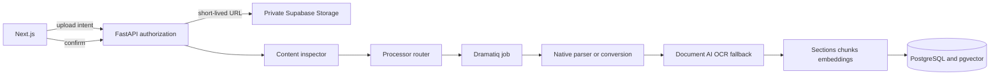

# File Ingestion Architecture

Company Brain accepts common safe business files through a provider-independent
gateway. Extensions and browser MIME values are hints; FastAPI determines the format
from bytes after the original is stored privately.

## Supported formats

| Format | Canonical MIME | Primary route | Fallback |
|---|---|---|---|
| PDF | `application/pdf` | native PDF parser | Document AI when no text |
| JPEG/JPG | `image/jpeg` | normalize orientation/metadata | Document AI OCR |
| PNG | `image/png` | normalize image | Document AI OCR |
| WebP | `image/webp` | normalize image | Document AI OCR |
| TIFF | `image/tiff` | convert to PNG | Document AI OCR |
| DOCX | Office Open XML Word MIME | native structured parser | clear failure |
| XLSX | Office Open XML Excel MIME | workbook parser | clear failure |
| XLS | `application/vnd.ms-excel` | legacy workbook parser | safe conversion when available |
| CSV | `text/csv` | deterministic row parser | clear failure |
| TXT | `text/plain` | UTF-8 text parser | encoding normalization |
| JSON | `application/json` | deterministic JSON parser | clear failure |
| PPTX | Office Open XML PowerPoint MIME | slide parser | clear failure |

Executable and macro-enabled formats are rejected. Password-protected, corrupt,
oversized, unknown proprietary, and unsafe files are not forced through an AI model.

## Trust and routing rules

- Originals are immutable private objects. Derivatives have their own checksum and a
  `source_file_id` link.
- Organization, business, and domain scope is checked in FastAPI before an intent,
  status read, retry, cancellation, or download is allowed.
- Image/table reports route to Document AI; Gemini is not the sole OCR path.
- Provider adapters accept canonical MIME values only and reject unsupported inputs
  before network calls.
- Document content is untrusted data and cannot change prompts, permissions, or tools.
- Attempts are bounded; deterministic failures are not retried.

## Limits

Defaults: images and Office files 25 MiB, PDFs/PPTX 50 MiB, text/CSV/JSON 10 MiB,
50 million image pixels. Deployment-wide upload limits remain configurable. Page,
archive expansion, worker memory, and provider time limits must also be enforced by the
processing runtime.
