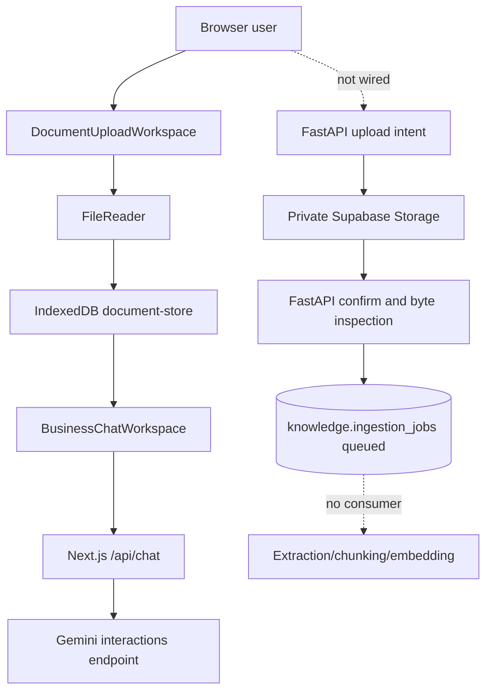

# Document Search UI Current State

**Inspected:** 2026-07-17  
**Branch:** `feat/document-search-reference-ui`

## Summary

Company Brain has a working Next.js foundation UI and a provider-independent FastAPI
file-inspection foundation, but the two paths are not connected. The browser currently
stores uploaded documents in IndexedDB and sends selected file content to a Next.js
Gemini route. FastAPI can create private Supabase upload intents and validate stored
bytes, but the frontend does not call those endpoints and no durable worker consumes
the queued ingestion jobs.

There is no production document search, typed identifier, survey-number, viewer,
download, extracted-section, chunk, embedding, citation, or document audit flow yet.

## Current route tree

```text
apps/web/app
├── /                         Foundation landing page
├── /login                    Static login form; no Supabase client integration
└── /app                      Foundation workspace
    ├── /app/chat             Browser-local chat sessions plus Next.js Gemini route
    ├── /app/documents        Browser-local upload and upload queue
    └── /app/settings         Static platform controls

apps/api
├── GET  /health
├── GET  /ready
├── GET  /api/v1/version
├── GET  /api/v1/auth/me
├── POST /api/v1/documents/upload-intents
├── POST /api/v1/documents/confirm
└── GET  /api/v1/documents/{document_id}/status
```

Required routes not currently present are `/app/search`, `/app/documents/upload`,
`/app/documents/[documentId]`, document detail/search/view/download APIs, and a trusted
chat API.

## Current visual structure

- `NavShell` renders a fixed 284px left navigation and a plain content region.
- The visual language uses green accents, slate text, 8px radii, and basic white cards.
- There is no top bar, breadcrumb/tabs header, context-sensitive right rail, mobile
  navigation, theme provider, or dark theme.
- Dashboard content describes the engineering foundation rather than document work.
- Documents and chat each implement their own large workspace component.
- Visible workspace data is fabricated in `lib/foundation-data.ts`.

## Current upload and processing flow



### Browser path

`DocumentUploadWorkspace` reads the full file, stores text or Base64 in IndexedDB,
and labels supported files `Ready for Gemini`. Chat sessions are stored in
`localStorage`. The Next.js `/api/chat` route sends up to six documents directly to
Gemini. This path has no server-side tenant authorization, durable metadata, search
index, citations, or secure document actions.

### Trusted backend path

FastAPI verifies membership and enabled business-domain scope before creating a
document, version, original-file row, private storage path, and signed upload intent.
After confirmation it downloads the original with the service role, inspects bytes,
records canonical MIME metadata, selects a processing plan, and creates one queued
job. The worker currently exposes only `health_check_actor`; queued ingestion jobs are
not processed.

## Current data model

### Core

- `core.organizations`
- `core.businesses`
- `core.users`
- `core.memberships`
- `core.domains`
- `core.business_domains`

### Knowledge

- `knowledge.documents`: scope, creator, display name, ingestion status
- `knowledge.document_versions`: version and processing timestamps
- `knowledge.document_files`: private object metadata and derivative linkage
- `knowledge.ingestion_jobs`: selected/fallback processor and safe/internal errors
- `knowledge.ingestion_attempts`: bounded retry history

Missing persistence includes identifiers, descriptive metadata, permissions beyond
membership scope, tags, extracted sections, chunks, embeddings, previews, views,
downloads, and audit events.

## Authentication and authorization

- FastAPI validates HS256 Supabase JWTs and maps `sub` to `core.users`.
- Upload intent authorization joins active membership to an enabled business domain.
- Status and confirmation currently restrict access to the creating user, which is
  safer than broad access but does not yet model shared business document permissions.
- The frontend login form is static and the frontend does not supply authenticated API
  requests.
- Browser-supplied business/domain identifiers do not grant backend access.

## Storage and signed URLs

- Originals are designed for private Supabase Storage paths scoped by organization,
  business, domain, document, and version.
- Signed upload creation and authenticated backend download exist.
- Signed view and signed download endpoints do not exist.
- Download auditing does not exist.
- The current user-facing path stores binaries in the browser instead of Supabase.

## Extraction, search, chat, and evidence

- File inspection, canonical MIME routing, native parsers, safe image conversion, and
  provider capability checks have unit coverage.
- There is no durable extraction actor, section/chunk persistence, FTS vector, pgvector
  embedding, or hybrid ranking implementation.
- There is no document or survey-number search endpoint.
- Chat does not resolve identifiers and does not retrieve server-authorized evidence.
- Gemini output is plain answer text with no stored evidence bundle or citations.

## Existing tests

- API: auth boundary, health, migrations, models, upload intent authentication,
  storage path safety, MIME inspection/routing, native parsing, retry/fallback.
- Web: page smoke tests, browser document storage, Gemini MIME helpers, API health.
- Worker: actor registration only.
- Missing: search/ranking, identifier normalization, signed URLs, tenant isolation,
  document detail, viewer, download audit, chat evidence, responsive shell, themes,
  upload-to-FastAPI integration, and end-to-end coverage.

## Missing functionality and risks

1. The active browser upload flow bypasses FastAPI and private storage.
2. Searchable metadata cannot be written before extraction because metadata fields and
   identifier persistence are absent.
3. Queued jobs never progress because no ingestion actor exists.
4. Gemini receives whole browser-held files, which is not scalable or auditable.
5. Static workspace data can disagree with authorized memberships.
6. Creator-only reads do not yet express business-wide document permissions.
7. No safe preview derivative or signed view/download flow exists.
8. No full-text/vector schema exists; semantic acceptance depends on implementing and
   exercising the indexing path, not merely rendering UI.
9. No audit schema migration currently records downloads.
10. The reference files are untracked supplied inputs and must be committed without
    importing their mutable JavaScript into production.

## Expected files to change

- `apps/web/app/**`, `apps/web/components/**`, `apps/web/lib/**`
- `apps/web/tailwind.config.ts`, `apps/web/package.json`, frontend tests
- `apps/api/app/models/knowledge.py`, document API/schemas/services
- `apps/api/app/services/search/**`, identifier normalization, storage signing
- `apps/api/alembic/versions/*`, API tests
- `apps/worker/app/**`, worker tests
- `ARCHITECTURE.md`, `README.md`, architecture/design/runbook/testing docs and ADRs

## Inspection conclusion

Implementation must first make FastAPI-backed document metadata and exact identifier
search the product spine. The reference design can then be converted into reusable
Next.js components around that trusted API. Browser-local storage may remain only as
an explicit offline/demo fallback and must not represent the production data path.
