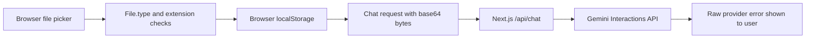

# File Ingestion Current State

Date: 2026-07-13

## Confirmed failing path

The deployed test slice stores files in browser `localStorage`; it does not yet use
Supabase Storage or the FastAPI ingestion worker.



The exact failure was reproduced against the configured Gemini Interactions API:

1. `document-upload-workspace.tsx` accepted the browser MIME at line 97.
2. `gemini.ts` represented every binary as `type: "document"`.
3. `route.ts` sent that part to `/v1beta/interactions`.
4. Gemini returned HTTP 400: `Unsupported MIME type: ` for a valid JPEG declared
   as `image/jpeg` because image bytes require an image part on this endpoint.
5. `route.ts` prefixed and exposed the provider message directly.

The same synthetic JPEG returned HTTP 200 when represented as:

```json
{"type":"image","data":"<base64>","mime_type":"image/jpeg"}
```

No private market report was committed or logged. The regression fixture is generated
in memory and has the same relevant JPEG signature and MIME behavior.

## Existing full-code foundations before this change

- FastAPI: health and authentication routes only.
- Supabase: configuration and core PostgreSQL entities only.
- Worker: Redis/Dramatiq health-check actor only.
- Storage upload/signed URL: not implemented.
- Ingestion jobs/document entities: not implemented.
- Document AI/OpenAI adapters and native parsers: not implemented.
- Processing UI: local ready/queued labels only.

## Status vocabulary before this change

Browser documents used `Ready for Gemini` or `Queued locally`. There was no durable,
retryable backend state machine.
